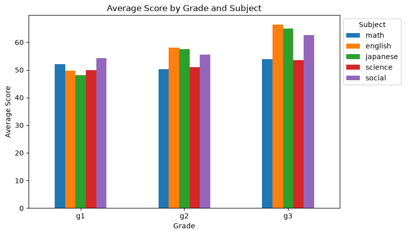
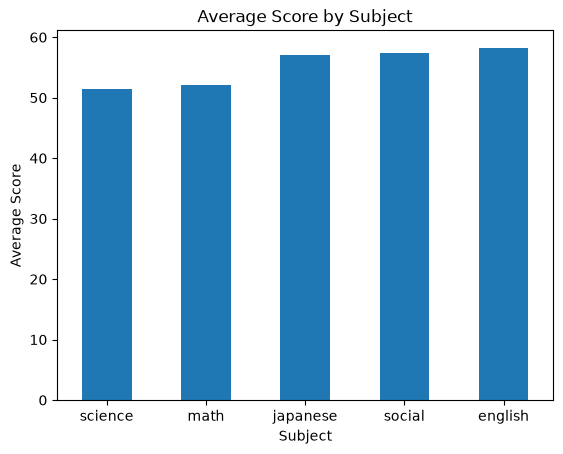
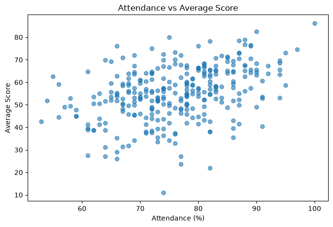

# Student Performance Analysis

## Overview

This project analyzes student performance data using Python, pandas, SQL, and PostgreSQL.

Inspired by my experience as a cram school instructor, I created a synthetic dataset of 300 students to investigate weak subjects, grade-level trends, subject relationships, and the relationship between attendance and academic performance.

The analysis combines Python-based data analysis with SQL queries in PostgreSQL.

## Key Findings

### 1. Average Score by Grade and Subject



Grade 3 students showed noticeably higher English scores compared with other grades, reflecting the dataset assumption that students preparing for entrance exams tend to have stronger English performance.

### 2. Average Score by Subject



Science and Mathematics had the lowest average scores among the five subjects, suggesting that they were the main weak subjects in this dataset.

### 3. Attendance vs Average Score



Attendance showed a positive correlation with average score (r = 0.39), indicating that students with higher attendance tended to achieve higher academic performance.

## Dataset Design

The dataset was intentionally designed to simulate realistic academic trends rather than using completely random values.

Key assumptions include:

* Grade 3 students have higher English scores due to entrance exam preparation.
* Mathematics and Science have relatively low average scores compared with the other subjects.
* Students with higher attendance tend to achieve higher average scores.
* Mathematics and Science show a positive correlation.
* English and Japanese show a strong positive correlation.
* Student performance follows a realistic distribution with a small number of high- and low-performing students.

## Analysis

### Python Analysis

* Number of students by grade
* Average scores by grade and subject
* Subject correlation analysis
* Weak subject ranking based on overall average scores
* Relationship between attendance and average score
* Attendance and average score correlation by grade
* Data visualization using bar charts and scatter plots

### SQL Analysis

* Number of students by grade
* Average score by grade
* Overall average score by subject
* Maximum and minimum score by subject
* Top 10 students by average score
* Students with average score below 60
* High attendance and high performance students
* Average attendance
* Student ranking by average score
* Correlation between attendance and average score
* Attendance and average score correlation by grade

## Skills Demonstrated

* Python data analysis
* SQL
* PostgreSQL
* Data cleaning and aggregation
* Statistical analysis
* Data visualization
* Database design

## Technologies Used

* Python
* pandas
* NumPy
* matplotlib
* PostgreSQL
* pgAdmin
* JupyterLab

## Project Structure

```text
student_analysis/
│
├── data/
│   └── student_data.csv
├── images/
│   ├── average_score_by_grade.png
│   ├── average_score_by_subject.png
│   └── attendance_vs_average.png
├── notebooks/
│   ├── 01_create_data.ipynb
│   └── 02_analysis.ipynb
├── report/
│   ├── report.ipynb
│   └── report.md
├── sql/
│   └── analysis.sql
└── README.md
```

## How to Run

### 1. Clone the repository

```bash
git clone git@github.com:ishida9801/student_analysis.git
cd student_analysis
```

### 2. Open the Jupyter Notebook

Open the project in JupyterLab and run:

```text
notebooks/02_analysis.ipynb
```

The notebook loads the dataset from:

```text
data/student_data.csv
```

### 3. PostgreSQL Analysis

The SQL analysis can be found in:

```text
sql/analysis.sql
```

The dataset can be imported into PostgreSQL and analyzed using the provided SQL queries.

## Future Improvements

* Add additional statistical analysis
* Improve data visualization
* Add interactive dashboards
* Expand the dataset with additional student attributes
* Compare different statistical approaches to identifying weak subjects